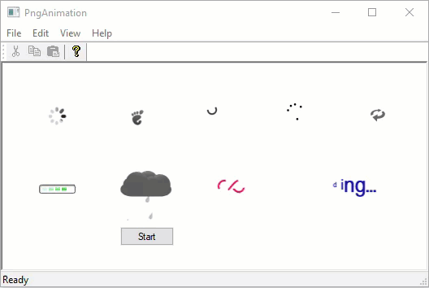

# PngAnimation



## Introduction

Often the program needs to show that it is currently performing some action. For example, a project is being loaded, a device is being searched, data is being converted or new data is being generated. In such cases, animation is used. One of the easiest ways to do this is to draw a graphic file that looks like this:


Frames are shown from left to right at regular intervals.

You can create such a file yourself or use one of the online services, for example https://loading.io . It is also possible to split some *apng* file into separate *png* files using the [APNG Disassembler](http://apngdis.sourceforge.net) program. After that, using a graphical editor, they can be combined manually into one file.

## Using the Code

To create the animation do the following:

```cpp
#include "PngAnimation.h"

PngAnimation m_Anim;
   …
if( !m_Anim.Create(NULL,IDB_PNG1,31) )
    return -1;   // error.
m_Anim.Start(m_hWnd, 50,50, ::GetSysColor(COLOR_WINDOW), 40,true);
````

The `PngAnimation` object works with *png* files. It is created once, for example, when creating a window. Next, you only need to call the `Start` function. If you passed `false` as the last parameter of the `Start`, then after showing all parts of the *png* file, the animation will stop. To start it, you need to call the `Start` function again.

Also, a color is passed to the `Start` function, which is used to fill the area occupied by the `PngAnimation` before drawing it.

The `PngAnimation` object does not use MFC and can be used in a regular Win32 API application.

Good luck! :-)
